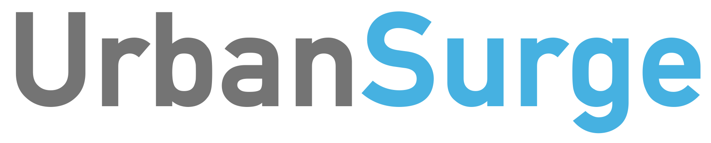

<!--  -->


UrbanSurge provides Python bindings and extensions to [pyswmm](https://www.pyswmm.org) for editing
and running SWMM models.

```python
    from urbansurge.swmm_model import SWMM
    
    cfg_path = './swmm_model_cfg.yml' # Path to configuration file.

    swmm = SWMM(cfg_path) # Create class instance.
    swmm.configure_model() # Configure model.
    swmm.run_simulation() # Run simulation.
```

## Documentation and API reference at [Read the Docs](https://urbansurge.readthedocs.io/en/latest/)